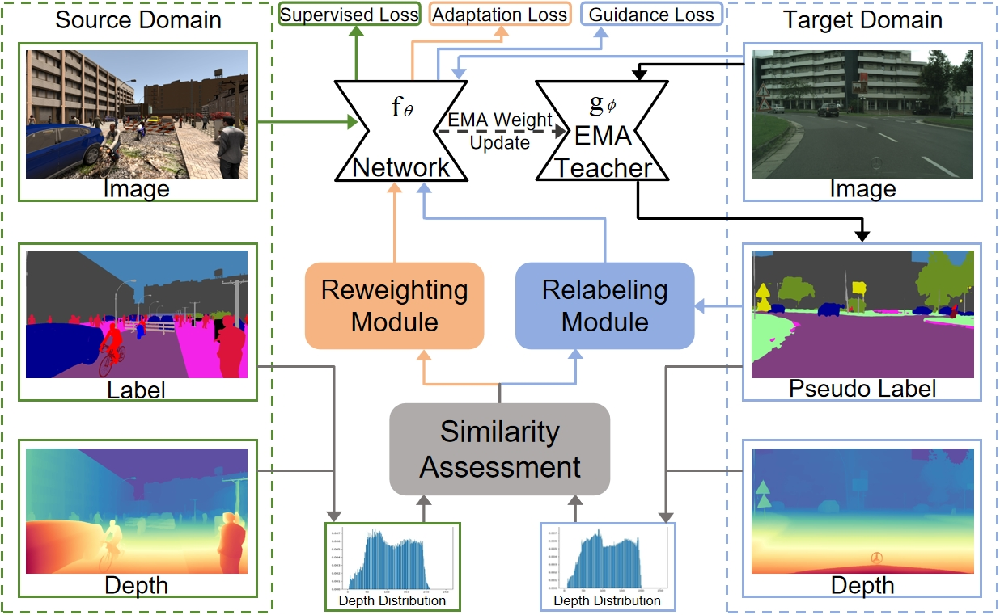
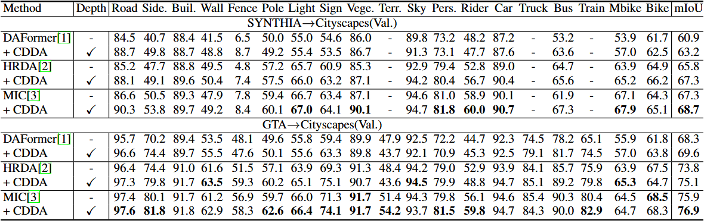
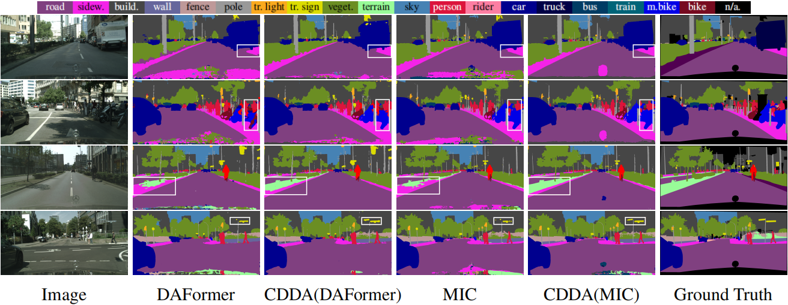

# CDDA for Domain-Adaptive Semantic Segmentation


## Overview



Unsupervised domain adaptation for semantic segmentation aims to 
transfer knowledge from synthetic data to real-world data. 
Geometric information, such as depth, has been shown 
to effectively bridge the domain gap. However, existing 
methods typically integrate depth features with 
semantic segmentation features to facilitate domain 
transfer. While this approach improves domain adaptation,
it also increases the complexity of the neural network 
and often leads to ambiguous exploitation of depth 
information. Additionally, these methods fail to evaluate
the similarity between cross-domain depth distributions of 
images and their corresponding semantic classes, leaving room 
for further enhancement. 

To address this challenge, we propose 
a novel image similarity assessment method based on the depth 
distribution similarity of semantic classes for domain adaptation.
Our approach adjusts the pseudo-label weights for target images 
at the class-wise level during self-training and guides the 
prediction of missing semantic classes in target images by 
leveraging the depth distribution of the most similar source 
image. This method can be seamlessly integrated into popular 
domain adaptation frameworks, such as the DAFormer network, 
without requiring modifications to the existing architecture. 

Experimental results demonstrate that our method significantly 
improves network performance.Our approach can be seamlessly 
integrated into UDA semantic segmentation frameworks, such 
as the DAFormer network architecture. When applied to DAFormer, 
HRDA, and MIC, our method yields performance gains of 2.1\%, 1.5\%, 
and 1.4\% on the SYNTHIA-to-Cityscapes benchmark, and 1.3\%, 1.3\%, 
and 1.0\% on the GTA-to-Cityscapes benchmark, respectively.



The improved domain adaptation performance is also reflected in the example
predictions on SYNTHIA→Cityscapes (1-2 rows), and GTA→Cityscapes (3-4 rows) as shown below.




## Environment Setup

* Python 3.8
* Pytorch  1.7.1
* CUDA 11.0
* mmcv-full 1.3.7
* Packages found in requirements.txt


Please, download the MiT-B5 ImageNet weights provided by [SegFormer](https://github.com/NVlabs/SegFormer?tab=readme-ov-file#training)
from their [OneDrive](https://connecthkuhk-my.sharepoint.com/:f:/g/personal/xieenze_connect_hku_hk/EvOn3l1WyM5JpnMQFSEO5b8B7vrHw9kDaJGII-3N9KNhrg?e=cpydzZ) and put them in the folder `pretrained/`.

## Dataset Setup
### Data Download
**Cityscapes:** Please, download leftImg8bit_trainvaltest.zip and
gt_trainvaltest.zip from [here](https://www.cityscapes-dataset.com/downloads/)
and extract them to `data/cityscapes`.

**GTA:** Please, download all image and label packages from
[here](https://download.visinf.tu-darmstadt.de/data/from_games/) and extract
them to `data/gta`.

**Synthia:** Please, download SYNTHIA-RAND-CITYSCAPES from
[here](http://synthia-dataset.net/downloads/) and extract it to `data/synthia`.


**Depth Images:** CDDA employs depth images generated by Depth Anything v2 
in a unified way. You can download the depth images [here](https://drive.google.com/drive/folders/1KZwbT1IzQnI5fdPq0vFw_FBOcgiY8wnT?usp=sharing) .<br>
Put the depth images into `data/{dataset}/depth_any`


The final folder structure should look like this:

```none
CDDA
├── ...
├── data
│   ├── cityscapes
│   │   ├── leftImg8bit
│   │   │   ├── train
│   │   │   ├── val
│   │   ├── gtFine
│   │   │   ├── train
│   │   │   ├── val
│   │   ├── depth_any
│   │   │   ├── train
│   │   │   ├── val
│   ├── synthia
│   │   ├── RGB
│   │   ├── GT
│   │   │   ├── LABELS
│   │   ├── depth_any
│   ├── gta
│   │   ├── images
│   │   ├── labels
│   │   ├── depth_any
├── ...
```

### Data Preprocessing
**Rare Class Sampling (RCS) and Get Train IDs:** Please run the following scripts to convert the label IDs to the
train IDs and to generate the class index for RCS:

```shell
python tools/convert_datasets/gta.py data/gta --nproc 8
python tools/convert_datasets/cityscapes.py data/cityscapes --nproc 8
python tools/convert_datasets/synthia.py data/synthia/ --nproc 8
```

**Get Processed Images and Depth Distribution Statistics:**
Please run the following scripts to save processed images and calculate the 
depth distribution over categories on them. This will take some time.<br>
--not_get_images and --not_get_distributions are optional and respectively represent not generating images and not calculating distributions
```shell
python run_seg.py --config {path to config} --dataset_name {gta or synthia} --source_preprocessed_path {path to save images and distribution} [--not_get_images] [--not_get_distributions]

#Example: CDDA with MIC on synthia→cityscapes
python run_seg.py --config configs/cdda/synthiaHR2csHR_cdda_mic --dataset_name synthia --source_preprocessed_path preprocessed/synthia_mic
```

## Training

For convenience, we provide  [annotated config files](configs/cdda)
of the final CDDA with DAFormer, HRDA, and MIC on each benchmark. <br>
Before training, modify parameters 'matrix_path', 'croped_images_path', and 'croped_labels_path' in the annotated config file.<br>
```annotated config file
matrix_path='preprocessed/synthia_mic/synthia_9400_distribution.pth'
croped_images_path='preprocessed/synthia_mic/images'
croped_labels_path='preprocessed/synthia_mic/labels'
```
A training job (e.g. CDDA(MIC) on SYNTHIA→Cityscapes) can be launched using:

```shell
python run_experiments.py --config configs/cdda/synthiaHR2csHR_cdda_mic
```

The logs and checkpoints are stored in `work_dirs/`.


The generated configs will be stored
in `configs/generated/`.

## Evaluation

A trained model can be evaluated using:

```shell
sh test.sh work_dirs/run_name/
```

The predictions are saved for inspection to
`work_dirs/run_name/preds`
and the mIoU of the model is printed to the console.

When training a model on Synthia→Cityscapes, please note that the
evaluation script calculates the mIoU for all 19 Cityscapes classes. However,
Synthia contains only labels for 16 of these classes. Therefore, it is a common
practice in UDA to report the mIoU for Synthia→Cityscapes only on these 16
classes. As the Iou for the 3 missing classes is 0, you can do the conversion
`mIoU16 = mIoU19 * 19 / 16`.


The predictions can be submitted to the public evaluation server of the
respective dataset to obtain the test score.

## Checkpoints

Below, we provide checkpoints of CDDA for the different benchmarks.
* [CDDA(MIC) for GTA→Cityscapes](https://drive.google.com/file/d/1xWc-WOviTST5FXB8Zwcjidc054wGi3N-/view?usp=sharing)
* [CDDA(HRDA) for GTA→Cityscapes](https://drive.google.com/file/d/11mBNbzl9qM_FLJWgVGWe4S6IhKDXEyhi/view?usp=sharing)
* [CDDA(DAFormer) for GTA→Cityscapes](https://drive.google.com/file/d/1nFCJ3R9JVv8frniYFQ1wd7sB84xaxFAy/view?usp=sharing)
* [CDDA(MIC) for Synthia→Cityscapes](https://drive.google.com/file/d/1Ol9Qw1hKZ2ygp5Yf7LJRLS54Z3klDxHc/view?usp=sharing)
* [CDDA(HRDA) for Synthia→Cityscapes](https://drive.google.com/file/d/1Qxxyn9Bz_U4qD8RDs85ia3oA4C5z8FP-/view?usp=sharing)
* [CDDA(DAFormer) for Synthia→Cityscapes](https://drive.google.com/file/d/10C6lpFu1iupgPDAsDu8gEgt7ei3oT_vG/view?usp=sharing)


## Framework Structure

This project is based on [mmsegmentation version 0.16.0](https://github.com/open-mmlab/mmsegmentation/tree/v0.16.0).
For more information about the framework structure and the config system,
please refer to the [mmsegmentation documentation](https://mmsegmentation.readthedocs.io/en/latest/index.html)
and the [mmcv documentation](https://mmcv.readthedocs.ihttps://arxiv.org/abs/2007.08702o/en/v1.3.7/index.html).

The most relevant files for CDDA are:

* [configs/cdda](configs/cdda):
  Annotated configs file for CDDA on GTA→Cityscapes and SYNTHIA→Cityscapes.
* [experiments.py](experiments.py):
  Definition of the experiment configurations.
* [mmseg/models/uda/depthmetric.py](mmseg/models/uda/depthmetric.py):
  Implementation of similarity assessment, reweighting and relabeling.
* [mmseg/models/uda/dacs.py](mmseg/models/uda/dacs.py):
  Implementation of CDDA, including the depthmetric, guidance training and image replacement.

## Acknowledgements

CDDA is based on the following open-source projects. We thank their
authors for making the source code publicly available.

* [Depth-Anything-v2](https://github.com/DepthAnything/Depth-Anything-V2)
* [MIC](https://github.com/lhoyer/MIC)
* [HRDA](https://github.com/lhoyer/HRDA)
* [DAFormer](https://github.com/lhoyer/DAFormer)
* [MMSegmentation](https://github.com/open-mmlab/mmsegmentation)
* [SegFormer](https://github.com/NVlabs/SegFormer)
* [DACS](https://github.com/vikolss/DACS)
